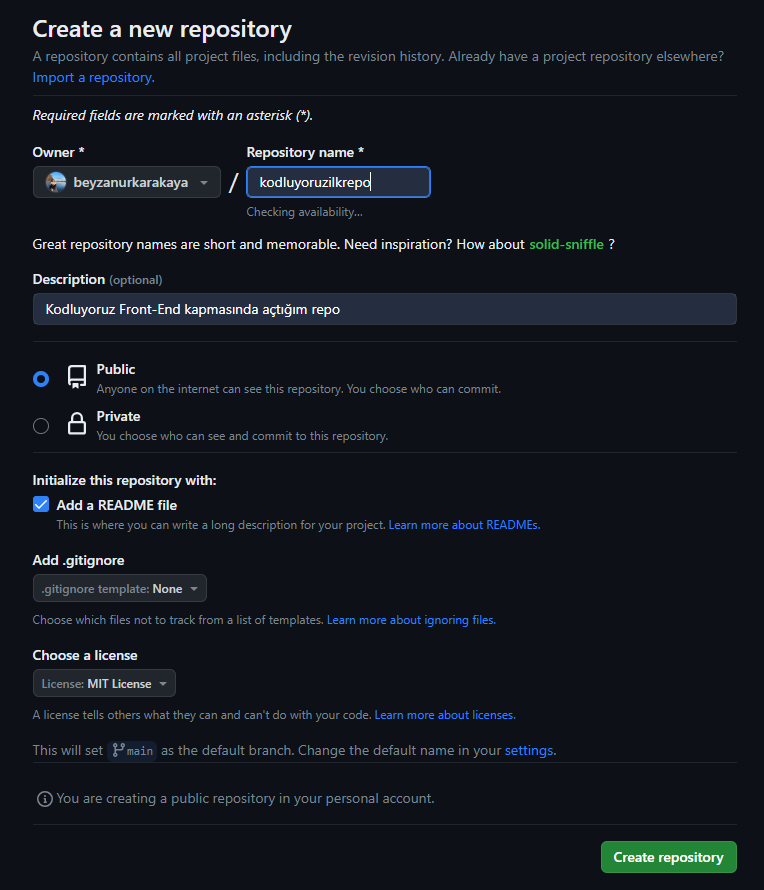

# Kodluyoruz Ilk Repo
Bu repo [Kodluyoruz](https://kodluyoruz.org/) Front-End Eğitiminde oluşturduğumuz ilk repo. İçerisinde bir adet README dosyası, bir adet de index.html barındırıyor.



## 💿 Installation
Öncelikle prejeyi clonelayın. (Buraya sizin reponuzdan aldığınız link gelecek)

```
git clone https://github.com/beyzanurkarakaya/kodluyoruzilkrepo.git
```

## 🖥️ Usage
Projeyi cloneladıktan sonra Visual Studio Code programından açınız.

Windows, Linux ve macOS için:
```
cd kodluyoruzilkrepo
code .
```
## 📌 Contributing
Pull requestler kabul edilir. büyük değişiklikler için, lütfen önce neyi değiştirmek istediğinizi tartışmak için bir konu açınız.
## 🔒 License
[MIT](https://choosealicense.com/licenses/mit/)
